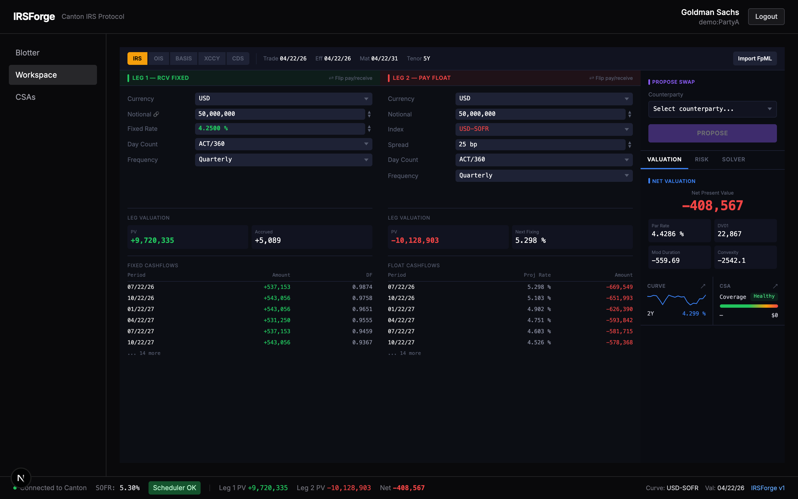
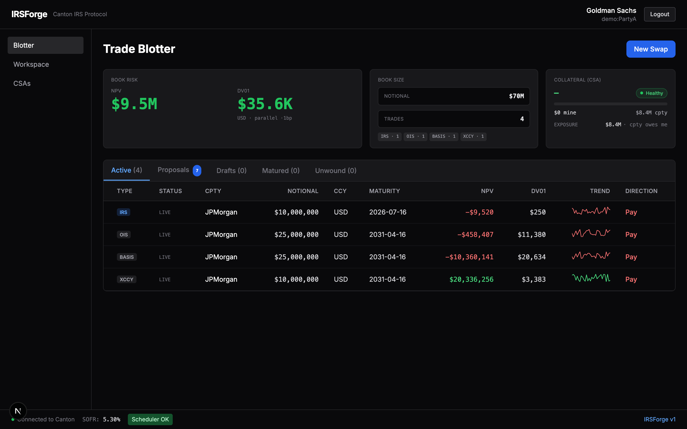
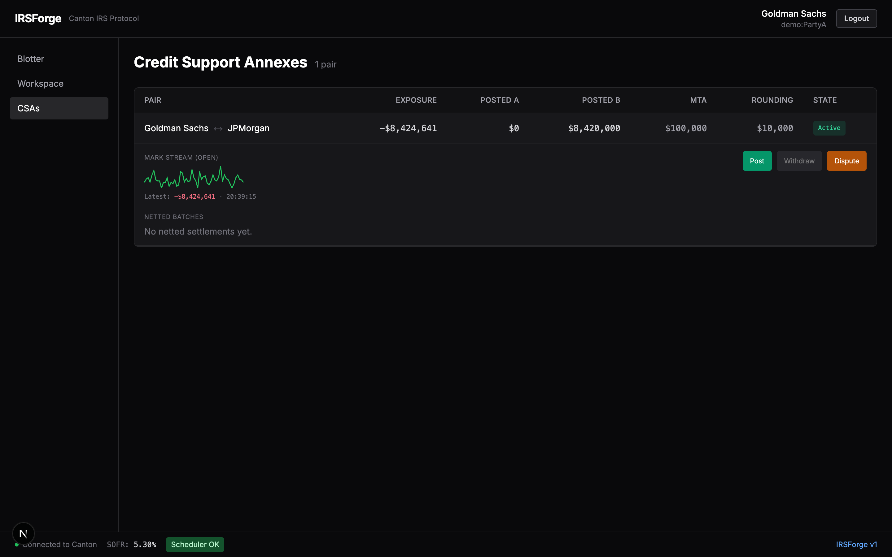

# IRSForge

**Privacy-first on-chain Interest Rate Swaps on Canton Network.** Built on Daml
Finance, Digital Asset's derivatives library. Daml is the language [ISDA and
Digital Asset have jointly used since 2018 to publish open-source CDM
derivatives reference code](https://www.isda.org/2020/10/06/isda-and-digital-asset-launch-cdm-clearing-pilot-using-daml/),
including a working IRS and CDS lifecycle implementation.

Engineered as a reference open-source implementation that real Canton
participants can adopt by editing one YAML file.

[](LICENSE)
[](contracts/daml.yaml)
[](#tests)

**Site:** [irsforge.com](https://irsforge.com)  ·  **Live demo:** [demo.irsforge.com](https://demo.irsforge.com)

## What it does

An ISDA-shaped IRS is the canonical TradFi back-office workflow. IRSForge maps
the full lifecycle onto Daml Finance with privacy, auditability, and continuous
on-chain settlement:

| Lifecycle stage | IRSForge surface |
|---|---|
| Create | `SwapProposal` template, accepted via `Daml.Finance.Interface.Instrument.Swap.V0.InterestRate.Factory` |
| Update | `TriggerLifecycle` evolves the instrument against on-chain `Observation`s |
| Transfer / fulfill | `Settle` + `Mature` run the canonical Daml Finance settlement chain (Discover, Instruct, Allocate, Approve, Settle) |
| Audit / report | Regulator role with cross-org `oversight / timeline / csa-board` views, on-chain `SettlementAudit` projection, FpML export |
| Issuer / holder / observer | Proposer (PartyA), counterparty (PartyB), regulator + scheduler |

## Quickstart

### 5-minute click-through

See **[docs.irsforge.com/judges/quickstart](https://docs.irsforge.com/judges/quickstart)** for a
narrated walkthrough of the propose, accept, lifecycle, CSA dispute, and
operator resolve flow, plus the regulator timeline + audit projection.

### Run locally

```bash
make setup    # install Daml SDK + Daml Finance bundle + npm workspaces
make demo     # bring up Canton sandbox + auth + oracle + frontend, seed demo data
              # then open http://localhost:3000
make stop     # shut everything down
make ci       # host-agnostic CI gate (lint + build + tests + docs); wrap in any pipeline runner
```

`scripts/demo.sh` orchestrates port preflight, init-script `ExitSuccess` gate,
seed marker, and per-service log files in `.demo/logs/`. `make logs SVC=oracle`
tails any service.

## What you can do



Pick one of two seeded counterparties (Goldman/JPMorgan), open the workspace,
compose a 5Y IRS at 100M notional. The right panel re-prices live: cashflows,
DV01/theta, and a fair-coupon solver, before you ever touch the on-chain Propose
button.



Once accepted, the trade lands in both counterparties' blotters. The off-chain
scheduler drives `TriggerLifecycleByScheduler`, mark sparklines tick, NPVs
update.



If the mark crosses MTA, a margin call appears on the CSA board. Post collateral
or dispute. Disputes route to an Operator who resolves and clears the call.

## Architecture

```
contracts/      Daml smart contracts on Daml Finance V0/V4
oracle/         Off-chain mark publisher + scheduler service (TypeScript)
app/            Next.js 16 / React 19 trader UI
auth/           Pluggable auth service (demo / built-in JWT / OIDC)
shared-config/  Zod-validated YAML config + Daml codegen
shared-pricing/ Pricing engine, risk metrics, FpML adapter
site/           Astro 5 marketing site (Cloudflare Pages)
docs-site/      Docusaurus reference docs (concepts / operations / judges)
```

Role model. Every swap and CSA carries `regulators : [Party]` (multi-jurisdiction
ready) and `scheduler : Party` (separate from operator for credential rotation):

- **Trader** (PartyA, PartyB): propose, accept, post collateral, dispute
- **Operator**: manual lifecycle override, factory authority, dispute resolver
- **Regulator**: read-only oversight, business-event timeline, CSA board (anti-leak Daml-level test asserts no write-class actions)
- **Scheduler**: automated lifecycle / settle-net / mature via sister `*ByScheduler` choices that close Daml 2.x's lack of disjunctive controllers

## What's real vs stubbed

| Surface | State |
|---|---|
| Daml Finance V0 IRS / OIS / Basis / XCCY / CDS factories | real, five families fully wired in workspace selector |
| Daml Finance V4 Lifecycle + Settlement chain | real: `Discover → Instruct → Allocate(Pledge) → Approve(TakeDelivery) → Batch.Settle` |
| Signed-CSB margin model with dispute / resolve | real, Bloomberg MARS / AcadiaSoft convention |
| FpML import / export | real, round-trip via `shared-pricing/src/fpml/` |
| `SettlementAudit` regulator projection | real, invoked from settle / mature / csa-net paths |
| NYFed SOFR live feed | adapter shipped (`oracle/src/providers/nyfed/`); demo runs `demo-stub`, swap is one YAML key |
| Multi-participant Canton topology (`topology: network`) | configured via schema + `docs-site/docs/operations/deploying-production.md`; not exercised by an integration test |
| CDS curve | flat hazard-rate stub (`demo.cdsStub.{defaultProb,recovery}` in YAML) |
| EFFR / FX / credit live providers | deferred, demo-stubs |
| ASSET swap workflow, CCY / FX / FpML proposal selector | hidden in `irsforge.yaml:observables.*` pending live providers |

## Demo vs production, one YAML key

`irsforge.yaml:1` is `profile: demo`. Flipping to `production` requires
non-default values in:

- `auth.provider: builtin | oidc` plus `auth.serviceAccounts` for `mark-publisher` and `scheduler`
- `topology: network` plus per-org `ledgerUrl`
- `curves.currencies.<CCY>.{discount,projection}.provider: nyfed | <custom>`

Schema enforcement: `loadConfig()` rejects `profile: production` with a
populated `demo:` subtree, and `validateProviderRefs` fails fast on unregistered
provider ids before the oracle accepts traffic.

See **[docs.irsforge.com/concepts/demo-vs-production](https://docs.irsforge.com/concepts/demo-vs-production)**
for the exhaustive switch list.

## Tests

| Workspace | Tests | Notes |
|---|---|---|
| `contracts/` (Daml-Script) | ~50 | `make test`: 38/38 templates created, 98.9% application-choice coverage |
| `app/` (vitest) | 1,213 | React + jsdom |
| `oracle/` (vitest) | 207 | + 2 sandbox-gated E2E |
| `shared-pricing/` (vitest) | 204 | pricing engine + strategies |
| `shared-config/` (node:test) | 155 | zod schema + cross-subtree validation |
| `auth/` (node:test) | 72 | JWKS + builtin + OIDC |
| `packages/canton-party-directory/` (vitest) | 41 | party-name resolver |

```bash
make test              # Daml only
make test-coverage     # full pyramid with per-workspace coverage thresholds
```

Per-workspace `vitest.config.ts` enforces coverage floors set to current minus
1pp. CI gate via `lint-staged` (`biome check --write` + `eslint --max-warnings 0`).

## Reading order for reviewers

1. **[docs.irsforge.com/judges/quickstart](https://docs.irsforge.com/judges/quickstart)**: 5-min demo walk
2. **[docs.irsforge.com/judges/tour](https://docs.irsforge.com/judges/tour)**: *why* every surface looks the way it does
3. **[docs.irsforge.com/concepts/csa-model](https://docs.irsforge.com/concepts/csa-model)**: signed-CSB model + the bug it fixed
4. **[docs.irsforge.com/operations/deploying-production](https://docs.irsforge.com/operations/deploying-production)**: what a participant configures
5. **[irsforge.yaml](irsforge.yaml)**: every product / role / provider / schedule, in one file

## License

[AGPL-3.0](LICENSE).
