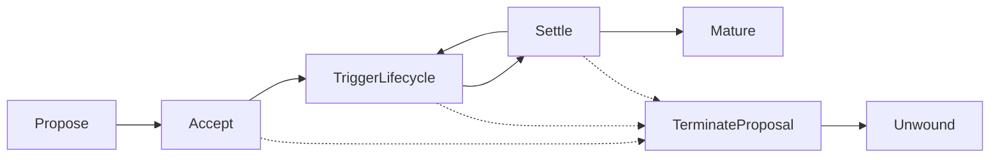

# Swap Lifecycle

Every product family follows the same lifecycle, mediated by Daml Finance's settlement primitives. Stages 1–4 are the happy path; Stage 5 (Mature) is the scheduled terminal state; Stage 6 (Terminate/Unwind) is the negotiated early-exit branch.



## Stage 1 — Propose

One counterparty creates a proposal template. The IRS flavour is `SwapProposal` (`contracts/src/Swap/Proposal.daml`); other families use their own templates (`OisProposal`, `BasisProposal`, `XccyProposal`, `CdsProposal`, `CcyProposal`, `FxProposal`, `AssetProposal`). Signatories are **proposer + operator** — the operator co-signs so the `Accept` body inherits the authority needed to exercise the Daml Finance factory's `Create` choice (see [Operator Role](./operator-role) for why this third-party signature is required). Counterparty (and regulator, where configured) are observers.

Proposal creation therefore requires a multi-party submit: `submitMulti [proposer, operator] []`.

Choices on the proposal (shape is family-specific):

| Choice | Controller | Effect |
|---|---|---|
| `Accept` / `<Family>Accept` | counterparty | Creates the on-chain Instrument + initial Holdings |
| `Reject` / `<Family>Reject` | counterparty | Archives proposal |
| `Withdraw` / `<Family>Withdraw` | proposer | Archives proposal |

**Choice-name convention:** IRS is the unprefixed family — `SwapProposal` exposes bare `Accept` / `Reject` / `Withdraw` (`contracts/src/Swap/Proposal.daml`, `app/src/features/workspace/constants.ts`). CDS, CCY, FX and Asset use type-prefixed choices (`CdsAccept`, `CcyAccept`, `FxAccept`, `AssetAccept`, …). Under operator-mediated `manual` policy every family also carries a `<Family>ProposeAccept` → `<Family>AcceptAck` two-step — see [Operator view wiring](../ui/operator).

## Stage 2 — Accept

`Accept` (IRS) / `<Family>Accept` runs the Daml Finance factory chain:

1. **Factory.Create** — operator authorises creation of the `Instrument` (depository / issuer / id / version / holdingStandard flat fields, see Daml Finance v0).
2. **Initial holdings** — both sides receive holdings representing their leg cashflows.
3. **Roll convention** — derived from `startDate`'s day-of-month; maturity DOM mismatches resolved via `lastRegularPeriodEndDate` back-stub (frequency-aware, ISDA convention).

## Stage 3 — TriggerLifecycle

Each instrument carries a `LifecycleRule`. The scheduler (or a manual trigger) invokes:

```
Lifecycle.Evolve  →  Effect contracts representing cashflows due
```

The scheduler service walks `instrument-events.ts` to find evolveable instruments, then calls `CreateFixingEventByScheduler` (sister choice to `CreateFixingEvent`) so the scheduler's authority alone is enough — see [Scheduler](../oracle/scheduler).

Outputs: `Effect` contracts on the ledger, ready for settlement.

## Stage 4 — Settle

The Daml Finance settlement chain:

```
Calculate  →  Discover routes  →  Instruct
   ↓
Allocate (Pledge)  +  Approve (TakeDelivery)
   ↓
Settle  →  Atomic transfer
```

For variation margin under a CSA, `SettleNetByScheduler` aggregates all pending effects across the netting set into a single transfer per currency.

`Pledge` requires **exact-amount** holdings; the publisher splits via `Fungible.Split` to produce the right-sized fragment.

## Stage 5 — Mature

Scheduled maturity — the swap ran to term.

**Trigger:** `MatureByScheduler` cron (or manual `Mature` choice, visible in demo). Fires once the last cashflow date passes and all effects are settled.

**On-chain:** `SwapWorkflow` archived, a `MaturedSwap` audit record created with the full originating payload + `actualMaturityDate`. The underlying Daml Finance `Instrument` is archived by the lifecycle layer.

**UI:**
- Blotter row leaves the **Active** tab and appears in the **Matured** tab with a `MAT` status code.
- Row drawer switches to read-only and exposes "Actual Maturity" alongside "Scheduled Maturity".
- No action buttons — the swap is terminal history.

**CSA impact:** the CSA contract itself persists (it's per-counterparty-pair, not per-swap under the signed-CSB model — see [CSA model](./csa-model)). The matured swap no longer contributes NPV to the netting set, so the next scheduler mark shrinks the CSB by that swap's residual PV. Any over-posted collateral is released via the standard withdraw flow on the CSA drawer; nothing automatic is returned at mature itself.

## Stage 6 — Terminate (Unwind)

Negotiated early close-out before scheduled maturity.

**Trigger:** either counterparty creates a `TerminateProposal` with a proposed PV amount (usually the current mid-market NPV) + a free-text reason. Counterparty exercises `TpAccept` to execute, or `TpReject` to kill the proposal. While the proposal is outstanding, the row shows `PEND UNWD` on the Active tab.

**On-chain (on `TpAccept`):**
1. A single atomic settlement chain transfers `|proposedPvAmount|` USD from the out-of-the-money side to the in-the-money side via Daml Finance's `Calculate → Discover → Instruct → Allocate/Approve → Settle` pipeline.
2. `SwapWorkflow` archived, `TerminatedSwap` audit record created with `terminatedByParty`, `reason`, `terminalDate`, and the agreed PV.

**UI:**
- Proposer: **Unwind** button on the blotter row drawer of an Active swap → opens modal with NPV prefilled, editable, plus a reason textarea.
- Counterparty: sees a `PEND UNWD` row with an **Accept / Reject Unwind** action in the drawer.
- After accept, the row moves to the **Unwound** tab; drawer shows `Terminated By`, reason, terminal date, and settled PV.

**CSA impact:** identical pattern to Mature — the CSA persists, the unwound swap drops out of the netting set, and any over-posted collateral is withdrawn separately. The PV transfer inside `TpAccept` is a direct holding transfer, **not** a CSA movement; it uses the same cash account as regular swap settlements.

## Per-family notes

| Family | Notable |
|---|---|
| **IRS** | Fixed leg + float leg, quarterly Act/360 by default |
| **OIS** | Single annual settlement, Act/360, SOFR/ESTR compounding |
| **BASIS** | SOFR vs EFFR, both legs floating |
| **XCCY** | Two-currency, NPV translated through `FxSpot` for reporting-ccy view |
| **CDS** | Premium leg + contingent leg; `Observation.observe` is **exact-time `Map.lookup`** so `lastEventTimestamp` must be grid-aligned |

## Scheduler vs manual

Every choice driven by the scheduler has a **sister choice** for manual operator/party invocation. In `demo` profile both paths are exposed (manual buttons visible per `scheduler.manualOverridesEnabled: true`); in `production` only the scheduler path runs.
